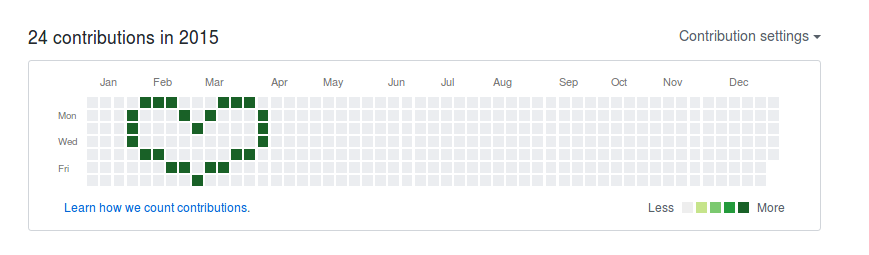
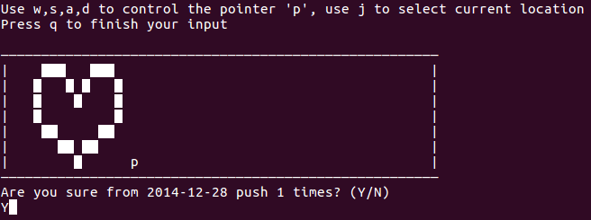

## gitpainter
gitpainter is a quick hack for generating your GitHub contribution pattern created by yourself. It can make your designed commits happen in the past. The current version (v1.0) only supports Linux. Be careful that gitpainter will change your repository's commit history.

### Result



### How to Use
Place `gitpainter.py` in your Git repository. Make sure that the repository is already  [connected to the remote server](https://help.github.com/articles/connecting-to-github-with-ssh/). Then run `gitpainter.py` in your Python interpreter. E.g.,
```
python gitpainter.py
```
Follow the instruction to input your requirements. Such as,
```
Find the target area for your new Github Contribution Pattern
Input the date of the top left corner of your target area
Input year: 2017
Input month: 4
Input day: 1
How many times you want to commit for a day? 2
```
The next step is to draw your own design pattern.  Use 'w' (up), 's' (down), 'a' (left), 'd' (right) to move the pointer('p'). Press 'j' to change the color in the current cell. Press 'q' to finish drawing. You may get something like,


Enter 'Y' to confirm your change. Wait for the commits finished and you will see the pattern in your GitHub.

Enjoy your own design!

### License
gitpainter is distributed under the GUN General Public License v3.0 (GPLv3).
